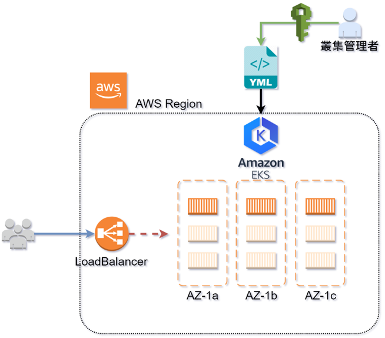

# DEMO 4.1

本例說明 **kubectl 部署, 埠轉發, 修改, 刪除** 等基本的用途


## 架構參考



---
## kubectl apply

透過 `kubectl apply` 部署, yaml 檔的路徑需要正確, 切換到正確資料夾  
`/environment/k8s-workshop/4.demo/4.1-nginx`  
執行指令 `kubectl apply -f nginx-1.14.0.yaml`  

```bash
# deploy Pod (Deployment) using yaml file
$ kubectl apply -f nginx-1.14.0.yaml
deployment.apps "nginx" created

# get Pod resource
$ kubectl get po
NAME                    READY     STATUS    RESTARTS   AGE
nginx-f7fbb6b58-qz9gm   1/1       Running   0          48s

```


## kubectl expose services

如果要將 nginx 指定給外部存取, 可透過 `kubectl apply -f nginx-svc.yaml` 將服務曝露

```bash
$ kubectl get svc
NAME         TYPE        CLUSTER-IP     EXTERNAL-IP   PORT(S)   AGE
kubernetes   ClusterIP   10.100.0.1     <none>        443/TCP   56m
nginx        ClusterIP   10.100.199.7   <none>        80/TCP    21m
```


## kubectl port-forward 

本例提供內部的 **cluster-ip 僅供內部存取**, 因此需透過 `kubectl port-forward` 來做 port-forward

```bash
# get Pod resource
$ kubectl get po
NAME                     READY     STATUS    RESTARTS   AGE
nginx-7457c78b7d-frfwg   1/1       Running   0          19m

# port-forward local 8080 to container 80 port
$ kubectl port-forward nginx-7457c78b7d-frfwg 8080:80
Forwarding from 127.0.0.1:8080 -> 80
Forwarding from [::1]:8080 -> 80
Handling connection for 8080
```


## kubectl edit

可以臨時變更 yaml 部署後的參數, 比如將: `container image` 修改為其他版本

```yaml
spec:
  containers:
    - image: nginx:1.14.0
```


## kubectl delete

測試完畢後, 刪除跟部署方式相同, 只需執行 `kubectl delete -f nginx-1.14.0.yaml` 即透過 yaml 文件刪除

```bash
# delete Pod (Deployment) using yaml file
$ kubectl delete -f nginx-1.14.0.yaml 
deployment.apps "nginx" deleted

# get pod resource
$ kubectl get po
NAME                    READY     STATUS        RESTARTS   AGE
nginx-f7fbb6b58-qz9gm   0/1       Terminating   0          2m
```

---
# 問題思考

Q: 請嘗試刪除 service 資源?  
Q: 假設要將 service 改成 AWS-ELB 方式, 可以如何處理?
