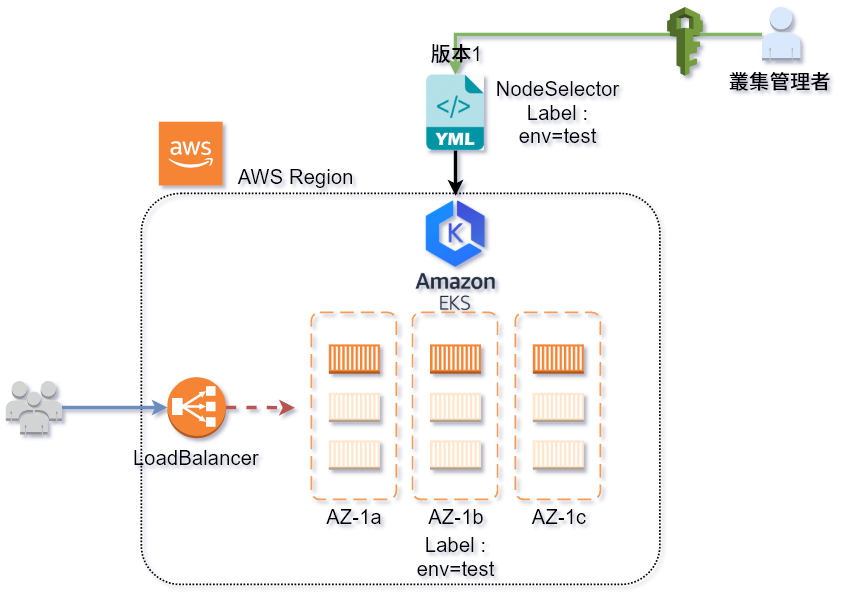

# DEMO 4.2

本例說明 **透過標籤選擇器將 Pod 部署到指定 Node**

-  一般而言, 部署應用程式時, 若不特別指定則 Kubernetes 會自動分配 Pod 到仍有資源的節點去 (隨機分配)  
-  如果要指定到特殊Node (如生產環境 ,測試環境, 高運算, 高I/O), 隨機分配會造成需求不符的問題
-  因此, 可透過使用 `kubectl label` 來使用 label ,將 Pod 指派到具有 label 的 Node


## 架構參考




## 4.2-node-selector

-  比較 nginx-v1.yaml 與 nginx-v2-nodeSelector.yaml 的差異?

---
## 動手做

-  請注意實際演練過程中的 **NODE 節點會不同，請勿直接照抄**

```bash
# get nodes
$ kubectl get nodes
NAME                                          STATUS    ROLES     AGE       VERSION
ip-172-31-26-88.us-west-2.compute.internal    Ready     <none>    1h        v1.10.3
ip-172-31-3-130.us-west-2.compute.internal    Ready     <none>    1h        v1.10.3
ip-172-31-46-237.us-west-2.compute.internal   Ready     <none>    1h        v1.10.3

# kubectl label node
$ kubectl label node ip-172-31-26-88.us-west-2.compute.internal env=test
node "ip-172-31-26-88.us-west-2.compute.internal" labeled

# get node again , and filiter env=test
$ kubectl get nodes --show-labels | grep env=test
ip-172-31-26-88.us-west-2.compute.internal    Ready     <none>    1h        v1.10.3   asgnode=true,beta.kubernetes.io/arch=amd64,beta.kubernetes.io/instance-type=t2.medium,beta.kubernetes.io/os=linux,env=test,failure-domain.beta.kubernetes.io/region=us-west-2,failure-domain.beta.kubernetes.io/zone=us-west-2b,kubernetes.io/hostname=ip-172-31-26-88.us-west-2.compute.internal

# deploy the yaml file with label  
$ kubectl apply -f nginx-v2-nodeSelector.yaml
deployment.apps "nginx" created

# get pod with " wide option"
$ kubectl get po -o wide
NAME                            READY     STATUS    RESTARTS   AGE       IP              NODE
nginx-789f57fd99-49kbh          1/1       Running   0          1h        172.31.24.95    ip-172-31-26-88.us-west-2.compute.internal

```

---
## 問題思考

Q: 同時使用多個標籤可以嗎?
