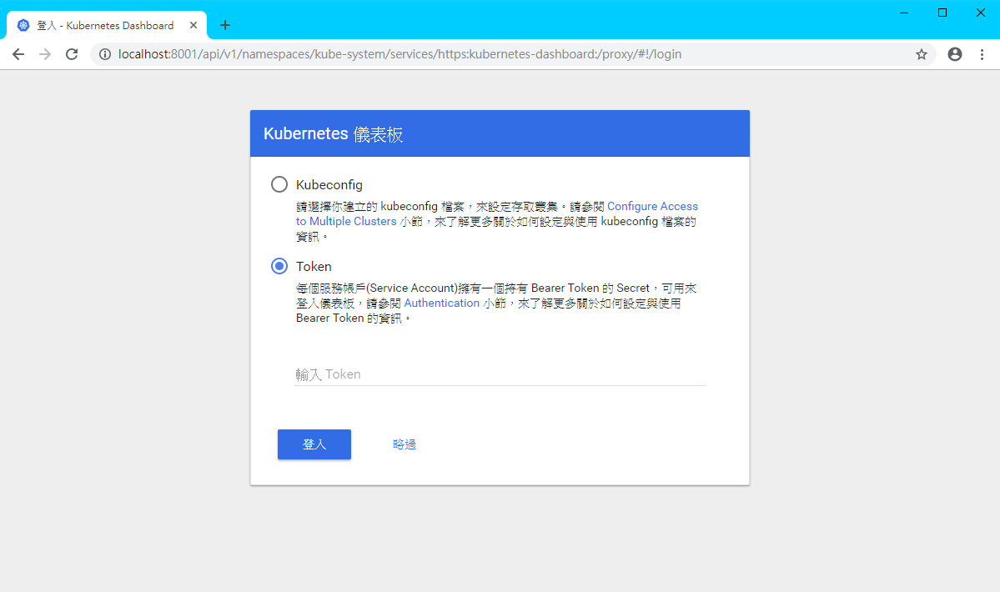
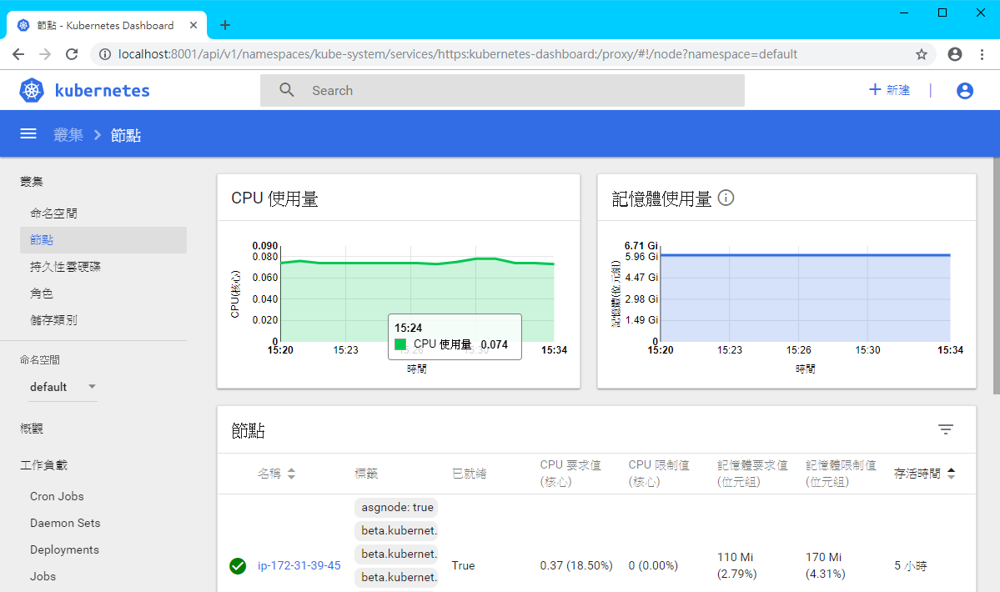

# Kubernetes Dashboard

**Cloud9 無法直接連線到 localhost, 因此這邊的測試需使用本機(筆電/桌機)來當作 kubectl client**

-  桌機或電腦預先安裝套件:
    -  kubectl <https://kubernetes.io/docs/tasks/tools/install-kubectl/> 
    -  heptio-authenticator-aws <https://github.com/kubernetes-sigs/aws-iam-authenticator/releases>
    -  awscli <https://aws.amazon.com/tw/cli/>
  

## Deploy Kubernetes Dashboard

參考以下說明, 部署前請切換到`install`的資料夾, 不要直接複製

```bash
# 部署dashboard
$ kubectl apply -f install/.

# 取得dashboard的token
$ kubectl -n kube-system describe secret $(kubectl -n kube-system get secret | grep eks-admin | awk '{print $1}')

# 啟動kubectl proxy
$ kubectl proxy
```


## Connect Kubernetes Dashboard

在電腦瀏覽器貼上以下URL  
<http://localhost:8001/api/v1/namespaces/kube-system/services/https:kubernetes-dashboard:/proxy/>


貼上剛剛取得的 Token 即可登入 Dashboard


## 官方參考
<https://github.com/kubernetes/dashboard>  
<https://docs.aws.amazon.com/eks/latest/userguide/dashboard-tutorial.html>  
