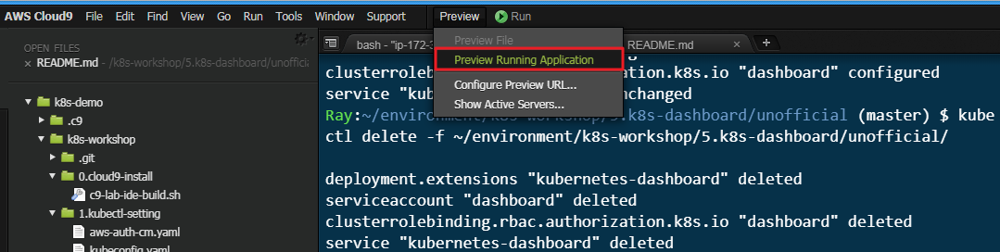

# Kubernetes Dashboard unofficial

可透過 cloud9 介面流覽

# 動手做

```bash

# deploy
$ kubectl apply -f ~/environment/k8s-workshop/5.k8s-dashboard/unofficial/
deployment.extensions "kubernetes-dashboard" created
serviceaccount "dashboard" created
clusterrolebinding.rbac.authorization.k8s.io "dashboard" created
service "kubernetes-dashboard" created

# get service
$ kubectl get svc -n kube-system
NAME                   TYPE        CLUSTER-IP      EXTERNAL-IP   PORT(S)         AGE
kube-dns               ClusterIP   10.100.0.10     <none>        53/UDP,53/TCP   22h
kubernetes-dashboard   NodePort    10.100.255.18   <none>        80:31634/TCP    27s

# port-forward to kubenetes-dashboard
$ kubectl port-forward -n kube-system svc/kubernetes-dashboard 8080:80
Forwarding from 127.0.0.1:8080 -> 9090
Forwarding from [::1]:8080 -> 9090

```

# 透過 cloud9 連線查看 kubernetes dashboard




# 刪除

-  請嘗試自行刪除看看!