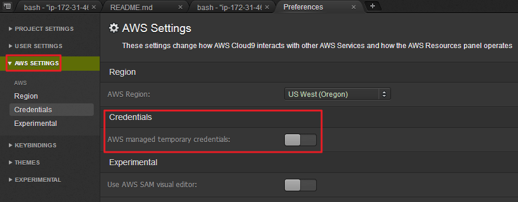

# AWS-EKS建置流程 (使用AWS Cloud9做為IDE環境)

## 準備工作  
- **不要使用"公司帳戶或正式環境"的AWS帳戶來測試**
- **實作DEMO請選擇 AWS Region, US West (Oregon), us-west-2**
- **使用AWS Admin / ROOT 權限的帳戶**
- **假設登入AWS帳戶的使用者為abc, 需在該使用者的IAM產生AccessKey**
- **AccessKey測試完畢後務必刪除**

### Cloud9的初始化設定
1.  Cloud9 開啟後, 於終端機貼上指令: `git clone https://github.com/ckmates/k8s-workshop.git`
2.  進入`0.cloud9-install`資料夾, 執行`sh c9-lab-ide-build.sh`, 執行完畢後請登出 (CTRL+D)並重新開另一個終端機視窗 (ALT+T)

### Cloud9的其它設定
-  關閉Cloud9自帶的Temp Credential  
  
-  調整文字大小顏色, 以個人舒適為主

### 設定Cloud9的AWSCLI
1.  在IAM視窗產生金鑰, 記下備用
2.  設定`aws cli`, 輸入`aws configure`進行設定

```bash
     $ aws configure
     AWS Access Key ID [ ***YOUR IAM ID*** ]: 
     AWS Secret Access Key [ ***YOUR IAM KEY*** ]: 
     Default region name [us-west-2]:
     Default output format [None]:
```
3.  設定完畢後, 測試一下aws cli是否正常, `aws s3 ls`, 應該可以看到一些S3 Bucket輸出


## 建立 EKS Cluster

### 建立EKS流程
1.  建立IAM ROLE並賦予EKS權限  
  
  
參考: <https://docs.aws.amazon.com/zh_tw/eks/latest/userguide/getting-started.html>
2.  切換到`EC2介面`, 建立`SecurityGroup`, 名稱 `EKS-Master`, `僅允許https 443`即可  
3.  切換到`EC2介面`, 建立`SSH key`
4.  切換到`EKS面板`, 建立Cluster, 依順序輸入必要欄位
5.  等後EKS介面出現`ACTIVE`, 建立的過程 `~10min`
6.  將畫面上的`API server endpoint` 與 `Certificate authority`記下備用

### 設定kubeconfig
1.  Cloud9初始化時, 已將空白`config`複製到`/home/ec2-user/.kube/config`
2.  直接使用Cloud9來編輯`config`, 或使用`vim /home/ec2-user/.kube/config`

找到`server, certificate-authority-data, args`欄位, 修改成自己的設定, 其它欄位不要修改

```yaml
server: < 從EKS取得的API Endpoint, 要帶https:// >
certificate-authority-data: < 從EKS取得的Certificate, 不要斷行 >

args:
  - "token"
  - "-i"
  - "< 建立EKS時的名稱 >"
```  

5.  存檔後在終端機輸入 `kubectl config view` 看設定值是否正確傳入  
6.  `kubectl get svc` 可測試是否能呼叫到EKS, 如沒有問題, 應該會出現類似以下的訊息:

```bash
NAME         TYPE        CLUSTER-IP   EXTERNAL-IP   PORT(S)   AGE
kubernetes   ClusterIP   10.100.0.1   <none>        443/TCP   7h
```

### 使用Cloudformation加入Node  

1.  從Cloud9左側的欄位中找到`2.add-node`資料夾
2.  選擇`eks-nodegroup-v2.yaml`按下右鍵選擇`Download`到電腦的桌面
3.  回到AWS, 選擇`Cloudformation` > `Upload a template to Amazon S3`  
選擇剛剛下載到桌面的`eks-nodegroup-v2.yaml`進行上傳  
4.  依序填入相關欄位  
5.  EC2 instances 預設 `t2.medium, Spot Instances`  
6.  完成後會開始建立Node, 過程 ~10min, 最後可以在Cloudformation取得`Outputs Value`  
7.  修改`aws-auth-cm.yaml`, 空白檔案已位於`/home/ec2-user/.kube/`, 修改方式與`kubeconfig`相同
8.  只要調整`- rolearn: <ARN of instance role (not instance profile)>`, 將之取代為`cloudformation outputs value`即可
9.  在此目錄下`/home/ec2-user/.kube/`使用`kubectl apply -f aws-auth-cm.yaml` 讓EKS將Node加入
10. 幾秒後, 使用 `kubectl get nodes`, 應可取得Node, 狀態Ready, 即完成EKS測試環境的建置

```bash
NAME                                         STATUS    ROLES     AGE       VERSION
ip-172-31-1-30.us-west-2.compute.internal    Ready     <none>    3h        v1.10.3
ip-172-31-20-21.us-west-2.compute.internal   Ready     <none>    3h        v1.10.3
ip-172-31-42-29.us-west-2.compute.internal   Ready     <none>    3h        v1.10.3
```
